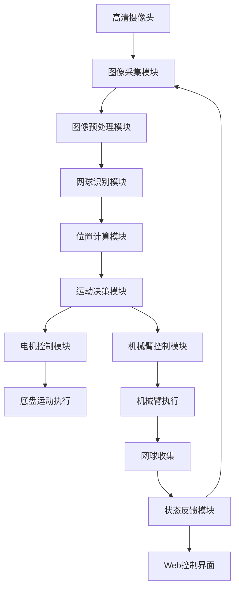
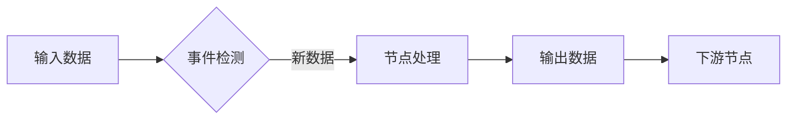

# **基于OpenCV的捡网球小车系统开发指南**

# 第一章 项目概述与环境搭建

## 1.1 项目目标与应用场景

### 项目目标

本项目旨在开发一个能够自动识别并收集网球的智能小车系统。系统通过摄像头实时捕捉环境图像，利用计算机视觉技术识别网球位置，然后控制小车移动并配合机械臂完成网球收集任务。项目融合了图像处理、运动控制和嵌入式系统开发等多个技术领域。

### 应用场景

1. **网球训练场**：自动收集散落在球场各处的网球
2. **体育器材管理**：减少人工收集成本
3. **教育演示**：机器人视觉系统的教学案例
4. **智能家居**：物品自动收集的参考实现

## 1.2 硬件组成清单

### 核心硬件

实际项目可能因具体版本有所调整，根据需求选择

| 部件         | 规格               | 功能说明             |
| ------------ | ------------------ | -------------------- |
| 主控板       | 飞腾派开发板       | 国产高性能嵌入式平台 |
| STM32控制器  | STM32F4系列开发板  | 实时运动控制         |
| 摄像头       | OV5647模块         | 500万像素，支持720P  |
| 电机驱动     | L298N双H桥驱动模块 | 直流电机控制         |
| 直流减速电机 | 12V/300RPM带编码器 | 四轮驱动             |
| 机械臂       | 4自由度串口舵机臂  | 支持角度控制         |

### 连接说明

1. 飞腾派通过USB串口连接STM32
2. STM32通过GPIO控制L298N
3. 摄像头直接连接到飞腾派CSI接口


## 1.3 软件环境配置指南

### 基础环境

```bash
sudo apt update
sudo apt install python3.11 python3.11-venv
```

### 创建虚拟环境

 为什么需要虚拟环境？：依赖隔离，版本控制，权限管理等

`pyproject.toml`中指定`requires-python = ">=3.8"`

```bash
python3.11 -m venv venv
source venv/bin/activate
```

### 安装核心依赖

```bash
pip install opencv-python==4.8.0.76
pip install numpy==1.24.3
pip install dora-rs==0.3.10
pip install pyarrow==12.0.1
pip install flask==2.3.2
pip install python-socketio==5.8.0
```

### 硬件驱动安装

```bash
# 安装I2C工具
sudo apt install i2c-tools

# 检测连接的I2C设备
sudo i2cdetect -y 1

# 安装串口工具
sudo apt install minicom
```

## 1.4 项目目录结构解析

### 项目目录结构

```
Phytium-Car-STM32-Arm-onPi/
│
├── car.service              # 系统服务配置文件（用于设置小车作为系统服务启动）
├── car.sh                   # 启动脚本（用于启动小车程序）
├── car_cv.py                # 小车视觉控制主逻辑（处理视觉数据并生成控制指令）
├── car_cv.yaml              # Dora框架配置文件（定义节点和输入输出关系）
├── car_stop.py              # 停止小车脚本（用于停止电机）
├── color_detect.py          # 颜色检测启动文件（主入口）
├── control.py               # 控制模块（提供Web控制界面和Socket.IO通信）
├── index.html               # Web控制界面HTML文件
├── move.py                  # 运动控制模块（封装运动指令发送）
├── README.md                # 项目说明文件
│
├── common/                  # 公共模块（数据结构和工具类）
│   ├── calculate.py         # 计算类（处理目标检测结果的数据结构）
│   ├── move_data.py         # 运动数据结构（用于节点间通信）
│   ├── test_move_data.py    # 运动数据结构测试
│   ├── view.py              # 视图数据类（用于Web显示）
│   └── __init__.py          # 包初始化文件
│
├── frame/                   # 存储摄像头捕获的原始帧图像
│
├── mask/                    # 存储掩膜图像
│
├── motor/                   # 电机控制模块
│   ├── main.py              # 电机控制主程序（接收运动指令并控制电机）
│   ├── Motor.py             # 电机控制基类和实现（PCA9685和Modbus）
│   ├── pyproject.toml       # 电机控制模块项目配置
│   └── test.py              # 电机控制测试脚本
│
├── mycv/                    # 计算机视觉模块
│   ├── color.py             # 颜色检测器类（识别网球）
│   ├── README.md            # 模块说明
│   └── __init__.py          # 包初始化文件
│
├── process/                 # 存储处理后的图像
│
├── templates/               # Web模板目录
│   └── index.html           # Web控制界面HTML模板
│
└── untils/                  # 工具模块
    ├── untils.py            # 工具函数（图像处理、方向转换等）
    └── __init__.py          # 包初始化文件
```


### **系统架构与原理**




### 说明各模块功能：

1. **图像采集模块**：
   - 使用OpenCV捕获视频流
   - 支持多种图像编码格式（BGR8, RGB8, JPEG, PNG）
   - 文件：`color_detect.py`, `untils/untils.py`
2. **图像预处理模块**：
   - 高斯模糊降噪
   - 中值滤波
   - HSV颜色空间转换
   - 形态学操作（开闭运算）
   - 文件：`mycv/color.py`
3. **网球识别模块**：
   - HSV颜色阈值分割
   - 轮廓检测与分析
   - 圆形度计算（过滤非网球物体）
   - 文件：`mycv/color.py`
4. **位置计算模块**：
   - 计算网球中心坐标
   - 计算网球在图像中的比例
   - 计算与图像中心的偏移量
   - 文件：`car_cv.py`, `common/calculate.py`
5. **运动决策模块**：
   - PID控制器实现平滑运动
   - 目标丢失处理策略
   - 速度平滑处理
   - 文件：`car_cv.py`
6. **电机控制模块**：
   - 支持PCA9685和Modbus两种驱动方式
   - 运动指令封装
   - 文件：`motor/Motor.py`, `move.py`
7. **底盘运动执行**：
   - 四轮底盘控制
   - 前进/后退/转向执行
   - 文件：`motor/main.py`
8. **机械臂控制模块**：
   - 串口通信控制
   - 抓取动作序列控制
   - 文件：`color_detect.py` (机械臂控制部分)
9. **机械臂执行**：
   - 网球抓取动作
   - 网球放置动作
   - 文件：`color_detect.py`
10. **网球收集**：
    - 完成网球收集任务
    - 重置系统状态
11. **状态反馈模块**：
    - 实时视频流传输
    - 运动数据显示
    - 系统状态反馈
    - 文件：`control.py`, `templates/index.html`
12. **Web控制界面**：
    - 摇杆控制
    - 视频显示
    - 状态监控
    - 控制开关
    - 文件：`templates/index.html`

### 数据流说明：

**视觉处理流**：
摄像头 → 图像采集 → 预处理 → 网球识别 → 位置计算 → 运动决策

**控制执行流**：
运动决策 → 电机控制 → 底盘运动
运动决策 → 机械臂控制 → 机械臂执行 → 网球收集

**反馈流**：
状态反馈 → Web控制界面（用户）
状态反馈 → 图像采集（系统循环）

## 学习建议

1. 初学者应先配置好基础环境，运行简单的OpenCV示例验证摄像头工作正常
2. 使用`color_test.py`单独测试网球识别效果，调整HSV阈值参数
3. 通过`motor/test.py`测试电机基本功能
4. 最后尝试运行完整系统

# 第二章 视觉处理基础理论

## 2.1 数字图像处理基础

### 什么是数字图像？

数字图像是由像素组成的二维矩阵，每个像素包含颜色信息。在我们的项目中，摄像头捕获的图像是640×480分辨率，即由307,200个像素点组成。

### 像素表示

- **RGB格式**：每个像素由红(Red)、绿(Green)、蓝(Blue)三个分量组成，每个分量取值范围0-255
- **BGR格式**：OpenCV默认使用BGR顺序而非RGB
- **灰度图**：单通道图像，每个像素只有一个亮度值(0-255)

### 图像处理基本操作

```python
# 读取图像
image = cv2.imread("image.jpg")

# 转换为灰度图
gray = cv2.cvtColor(image, cv2.COLOR_BGR2GRAY)

# 调整大小
resized = cv2.resize(image, (320, 240))

# 旋转图像
rotated = cv2.rotate(image, cv2.ROTATE_90_CLOCKWISE)
```

## 2.2 色彩空间与HSV原理

### RGB的局限性

RGB色彩空间对光照变化敏感，在网球识别中表现不佳。因此我们使用HSV色彩空间。

### HSV色彩空间

- **Hue(色调)**：颜色类型，0-180°（在OpenCV中）
- **Saturation(饱和度)**：颜色纯度，0-255
- **Value(明度)**：颜色亮度，0-255

HSV空间更接近人类对颜色的感知，对光照变化不敏感。

### 为什么选择HSV识别网球？

1. 色调(H)可以稳定表示网球颜色
2. 饱和度(S)帮助区分鲜艳的网球和背景
3. 明度(V)可以过滤过暗或过亮的区域

### HSV阈值设置

```python
# 网球HSV阈值范围
lower_tennis = np.array([30, 70, 80])   # 最低H,S,V值
upper_tennis = np.array([50, 255, 255]) # 最高H,S,V值

# 创建颜色掩膜
mask = cv2.inRange(hsv_image, lower_tennis, upper_tennis)
```

## 2.3 图像预处理技术详解

### 高斯模糊降噪

```python
blurred = cv2.GaussianBlur(image, (5, 5), 0)
```

- **原理**：使用高斯函数计算邻域像素的加权平均值
- **作用**：减少图像噪声，平滑细节
- **参数说明**：(5,5)是核大小，0是标准差(自动计算)

### 中值滤波

```python
median = cv2.medianBlur(image, 5)
```

- **原理**：取邻域像素的中值作为中心像素值
- **作用**：有效去除椒盐噪声
- **与高斯模糊区别**：更擅长处理脉冲噪声，但计算量更大

### 形态学操作

```python
kernel = cv2.getStructuringElement(cv2.MORPH_RECT, (5, 5))
opened = cv2.morphologyEx(mask, cv2.MORPH_OPEN, kernel)
```

- **开运算**：先腐蚀后膨胀，去除小噪点
- **闭运算**：先膨胀后腐蚀，填充小孔洞
- **结构元素**：定义操作形状和大小的核

## 2.4 目标识别核心算法

### 轮廓检测

```python
contours, _ = cv2.findContours(mask, cv2.RETR_EXTERNAL, cv2.CHAIN_APPROX_SIMPLE)
```

- **原理**：在二值图像中查找连通区域边界
- **RETR_EXTERNAL**：只检测最外层轮廓
- **CHAIN_APPROX_SIMPLE**：压缩轮廓点，减少内存

### 轮廓分析

```python
for cnt in contours:
    area = cv2.contourArea(cnt)
    perimeter = cv2.arcLength(cnt, True)
    circularity = 4 * np.pi * area / (perimeter * perimeter)
```

- **面积过滤**：去除过小或过大的区域
- **圆形度计算**：判断轮廓接近圆形的程度
- **边界框**：获取目标位置和大小

### 位置计算

```python
# 计算网球中心坐标
center_x = x + w // 2
center_y = y + h // 2

# 计算网球在图像中的比例
ratio = (h / image_height) * (w / image_width)
```

# 第三章 网球检测系统实现

## 3.1 颜色阈值分割实战

### HSV阈值分割原理

颜色阈值分割是网球识别的核心步骤，通过定义HSV空间中的上下限阈值，提取网球区域：

```python
# 网球HSV阈值范围
lower_tennis = np.array([30, 70, 80])   # 最低H,S,V值
upper_tennis = np.array([50, 255, 255]) # 最高H,S,V值

# 创建颜色掩膜
mask = cv2.inRange(hsv_image, lower_tennis, upper_tennis)
```

### 参数调整技巧

1. **色调(H)**：30-50对应黄绿色范围
2. **饱和度(S)**：70以上确保颜色足够鲜艳
3. **明度(V)**：80以上避免过暗区域

### 实际应用中的挑战

- 光照变化：晴天和阴天需要不同阈值
- 场地反光：可能导致误识别
- 阴影影响：降低明度阈值可减少阴影影响

### 自适应阈值方法

```python
# 动态调整阈值
def adjust_thresholds(light_level):
    if light_level < 50:  # 低光照环境
        return np.array([25, 60, 60]), np.array([55, 255, 200])
    else:  # 正常光照
        return np.array([30, 70, 80]), np.array([50, 255, 255])
```

## 3.2 形态学处理技术应用

### 开闭运算组合

```python
# 开运算去除小噪点
mask = cv2.morphologyEx(mask, cv2.MORPH_OPEN, kernel)
# 闭运算填充小孔洞
mask = cv2.morphologyEx(mask, cv2.MORPH_CLOSE, kernel)
```

### 结构元素选择

```python
# 椭圆结构元素更适合圆形目标
kernel = cv2.getStructuringElement(cv2.MORPH_ELLIPSE, (5, 5))
```

### 迭代次数优化

```python
# 多次迭代增强效果
mask = cv2.morphologyEx(mask, cv2.MORPH_OPEN, kernel, iterations=2)
mask = cv2.morphologyEx(mask, cv2.MORPH_CLOSE, kernel, iterations=3)
```

### 形态学处理效果

1. **开运算**：消除小噪点，分离粘连物体
2. **闭运算**：填充内部空洞，平滑边界
3. **组合使用**：得到更完整的网球区域

## 3.3 轮廓分析与特征提取

### 轮廓检测实现

```python
contours, _ = cv2.findContours(
    mask, 
    cv2.RETR_EXTERNAL,  # 只检测最外层轮廓
    cv2.CHAIN_APPROX_SIMPLE  # 压缩水平、垂直和对角线段
)
```

### 关键特征提取

```python
for cnt in contours:
    # 计算轮廓面积
    area = cv2.contourArea(cnt)
    
    # 计算轮廓周长
    perimeter = cv2.arcLength(cnt, True)
    
    # 计算圆形度（1表示完美圆形）
    circularity = 4 * np.pi * area / (perimeter * perimeter)
    
    # 获取边界矩形
    x, y, w, h = cv2.boundingRect(cnt)
    
    # 计算长宽比
    aspect_ratio = w / float(h)
```

### 网球识别条件

```python
if (area > min_area and area < max_area and 
    circularity > 0.8 and 
    0.8 < aspect_ratio < 1.2):
    # 识别为网球
```

## 3.4 位置计算与坐标转换

### 中心点计算

```python
center_x = x + w // 2
center_y = y + h // 2
```

### 相对位置计算

```python
# 计算与图像中心的偏移
offset_x = center_x - image_center_x
offset_y = center_y - image_center_y

# 标准化偏移量
normalized_x = offset_x / (image_width / 2)
normalized_y = offset_y / (image_height / 2)
```

### 尺寸比例计算

```python
# 网球在图像中的比例
size_ratio = (w * h) / (image_width * image_height)

# 距离估计（经验公式）
distance = 1.0 / (size_ratio ** 0.5)
```

### 坐标转换到小车坐标系

```python
# 假设摄像头安装高度为H，俯仰角为θ
def image_to_world(x, y, size_ratio):
    # 计算深度
    Z = H / (size_ratio * math.tan(math.radians(θ)))
    
    # 计算世界坐标
    world_x = (x - image_center_x) * Z / focal_length
    world_y = (y - image_center_y) * Z / focal_length
    
    return world_x, world_y, Z
```


# 第四章 底盘运动控制技术

## 4.1 底盘控制原理

### 差速转向模型

差速转向是轮式移动机器人最基础也是最常用的运动控制方式。在本项目中，我们采用四轮底盘结构，其中两个主动轮分别位于左右两侧。这种设计的核心原理在于通过控制左右轮的速度差来实现转向：当左右轮以相同速度转动时，小车直线前进；当左右轮速度不同时，小车会向速度较慢的一侧转向。

**运动学方程**：

```markdown
v = (v_left + v_right)/2  // 线速度
ω = (v_right - v_left)/L // 角速度
```

其中L为轮距（左右轮中心距离）。通过精确控制v_left和v_right，我们可以实现小车的任意轨迹运动。

### 坐标变换与位姿估计

小车在运动过程中需要实时估计自身位置和姿态（位姿）。我们采用基于编码器的航迹推算法（Odometry）：

```python
# 编码器计数转换为位移
left_distance = left_encoder_counts * encoder_resolution
right_distance = right_encoder_counts * encoder_resolution

# 计算位姿变化
delta_distance = (left_distance + right_distance) / 2
delta_theta = (right_distance - left_distance) / wheel_base

# 更新位姿
x += delta_distance * cos(theta + delta_theta/2)
y += delta_distance * sin(theta + delta_theta/2)
theta += delta_theta
```

这种方法虽然存在累积误差，但在短距离运动中精度足够，且计算量小，适合嵌入式平台。

## 4.2 驱动电路设计

### H桥驱动原理

H桥电路是直流电机控制的核心，它由四个开关元件（MOSFET或晶体管）组成H形结构：

```markdown
   Vcc
    |
 Q1   Q3
  |   |
  M - M  ← 电机
  |   |
 Q2   Q4
    |
   GND
```

通过控制四个开关的状态，可以实现电机的正反转和制动：

- Q1、Q4导通：电机正转
- Q2、Q3导通：电机反转
- Q1、Q3导通：电机制动
- Q2、Q4导通：电机制动

### L298N驱动模块应用

本项目采用广泛使用的L298N双H桥驱动模块：

```python
# 引脚定义
IN1 = 11  # 控制电机A方向
IN2 = 13  # 控制电机A方向
IN3 = 15  # 控制电机B方向
IN4 = 16  # 控制电机B方向
ENA = 12  # 电机A使能/PWM
ENB = 14  # 电机B使能/PWM

# 前进控制
GPIO.output(IN1, GPIO.HIGH)
GPIO.output(IN2, GPIO.LOW)
GPIO.output(IN3, GPIO.HIGH)
GPIO.output(IN4, GPIO.LOW)
pwmA.ChangeDutyCycle(speed)  # 设置PWM占空比控制速度
pwmB.ChangeDutyCycle(speed)
```

### 保护电路设计

为确保系统安全，我们实现了多重保护机制：

1. **过流保护**：在电源输入端串联自恢复保险丝
2. **电压监测**：实时检测电池电压，低于阈值时自动停止
3. **温度保护**：驱动芯片温度超过85℃时降低输出功率
4. **软件保护**：在代码中添加互锁逻辑，防止同侧上下管同时导通

## 4.3 运动控制算法

### PID控制器实现

PID（比例-积分-微分）控制器是工业控制中最常用的算法：

```python
class PIDController:
    def __init__(self, Kp, Ki, Kd, setpoint):
        self.Kp = Kp
        self.Ki = Ki
        self.Kd = Kd
        self.setpoint = setpoint
        self.prev_error = 0
        self.integral = 0
        
    def compute(self, measured_value):
        error = self.setpoint - measured_value
        self.integral += error
        derivative = error - self.prev_error
        output = self.Kp * error + self.Ki * self.integral + self.Kd * derivative
        self.prev_error = error
        return output
```

### 双闭环控制系统

我们采用速度环+位置环的双闭环控制结构：

```markdown
位置指令 → 位置PID → 速度指令 → 速度PID → 电机驱动
      ↑位置反馈          ↑速度反馈
```

- **位置环**：控制小车到达目标位置
- **速度环**：控制电机达到指定转速

### 轨迹跟踪算法

对于网球捡拾任务，我们实现了简单的轨迹跟踪：

```python
def follow_trajectory(current_pos, target_pos):
    # 计算位置偏差
    dx = target_pos[0] - current_pos[0]
    dy = target_pos[1] - current_pos[1]
    
    # 计算目标方向
    target_angle = atan2(dy, dx)
    
    # 角度偏差
    angle_error = target_angle - current_pos[2]
    
    # 距离目标距离
    distance = sqrt(dx*dx + dy*dy)
    
    # 双PID控制
    angle_output = angle_pid.compute(angle_error)
    speed_output = speed_pid.compute(distance)
    
    # 转换为左右轮速
    left_speed = speed_output - angle_output
    right_speed = speed_output + angle_output
    
    return left_speed, right_speed
```

## 4.4 底盘控制系统集成

### 串口通信协议

底盘控制器（STM32）与主控板（飞腾派）通过串口通信：

```markdown
协议格式：<STX> [CMD] [LEN] [DATA] [CHK] <ETX>
- STX: 起始字节(0xAA)
- CMD: 命令字节
- LEN: 数据长度
- DATA: 数据内容
- CHK: 校验和
- ETX: 结束字节(0x55)
```

### 状态机实现

底盘控制采用有限状态机模型：

```python
class ChassisStateMachine:
    STATES = {
        'IDLE': 0,
        'MOVING': 1,
        'ROTATING': 2,
        'EMERGENCY': 3
    }
    
    def __init__(self):
        self.state = self.STATES['IDLE']
        
    def handle_event(self, event):
        if self.state == self.STATES['IDLE']:
            if event == 'START_MOVE':
                self.start_moving()
            elif event == 'START_ROTATE':
                self.start_rotating()
                
        elif self.state == self.STATES['MOVING']:
            if event == 'TARGET_REACHED':
                self.stop()
            elif event == 'OBSTACLE_DETECTED':
                self.emergency_stop()
                
        # ...其他状态转换
```

### 安全保护机制

1. **超时保护**：指令执行超过设定时间自动停止
2. **碰撞检测**：通过电流突变检测碰撞
3. **边界限制**：设置运动范围边界
4. **紧急停止按钮**：硬件级急停开关

### 性能优化技巧

1. **指令缓冲**：使用队列缓存指令，避免丢失
2. **速度斜坡**：限制加速度，使运动更平滑
3. **预测控制**：基于当前状态预测未来位置
4. **动态参数调整**：根据负载自动调整PID参数

## 小结

底盘运动控制是网球捡拾小车的核心子系统。本章详细介绍了差速转向原理、驱动电路设计、PID控制算法实现以及系统集成方案。通过精确的运动控制，小车能够准确移动到网球位置，为后续的捡拾操作奠定基础。

> **关键要点回顾**：
>
> 1. 差速转向模型是轮式机器人的基础运动原理
> 2. H桥电路实现了电机的正反转和调速控制
> 3. PID控制器提供了精确的速度和位置控制
> 4. 状态机模型使控制系统更加可靠和安全

# 第五章 机械臂控制系统

## 5.1 机械臂结构分析

### 4自由度机械臂设计

本系统采用4自由度机械臂结构，这种设计在灵活性和复杂度之间取得了良好平衡。机械臂的四个自由度分别为：

1. **基座旋转关节**（0-180°）：控制整个机械臂的水平旋转
2. **肩关节**（0-90°）：控制大臂的俯仰运动
3. **肘关节**（0-120°）：控制小臂的俯仰运动
4. **腕关节**（0-180°）：控制末端执行器的方向

**工作空间分析**：
 机械臂的工作空间是一个半球形区域，半径约30cm，高度范围15-45cm。这种设计特别适合地面网球捡拾任务，能够覆盖小车周围的大部分区域。

### 舵机选型与扭矩计算

机械臂采用数字舵机驱动，选型基于负载分析和运动需求：

| 关节位置 | 型号   | 扭矩     | 速度      | 特点             |
| -------- | ------ | -------- | --------- | ---------------- |
| 基座     | MG996R | 15kg·cm  | 0.17s/60° | 金属齿轮，高扭矩 |
| 肩关节   | MG946R | 25kg·cm  | 0.20s/60° | 双轴承，抗冲击   |
| 肘关节   | MG995  | 13kg·cm  | 0.16s/60° | 性价比高         |
| 腕关节   | SG90   | 1.8kg·cm | 0.12s/60° | 轻量化设计       |

**扭矩计算示例（肩关节）**：

```markdown
所需扭矩 = (臂长 × 负载重量) + (关节重量 × 臂长/2)
          = (0.2m × 0.2kg) + (0.15kg × 0.1m)
          = 0.04Nm + 0.015Nm = 0.055Nm ≈ 5.6kg·cm
```

选择25kg·cm舵机提供足够的安全裕度。

## 5.2 抓取机构设计

### 夹持机构力学分析

网球抓取机构采用双指平行夹持设计，具有以下特点：

- **自适应抓取**：弹簧预紧机构使夹爪能适应不同尺寸网球
- **力控制**：通过限位开关实现抓握力控制
- **防滑设计**：夹爪内侧采用硅胶垫增加摩擦力

**力学模型**：

```markdown
抓握力F = k × Δx
其中：
k - 弹簧刚度系数
Δx - 弹簧压缩量
```

通过调整弹簧预压缩量，可以控制抓握力在2-5N范围内，既能牢固抓取网球，又不会造成损坏。

### 物体稳定性控制

为确保网球在移动过程中不脱落，我们采用多阶段抓取策略：

1. **预抓取阶段**：夹爪以较小力度接触网球
2. **稳定抓取**：增加抓握力至安全阈值
3. **提升阶段**：缓慢提升机械臂
4. **运输阶段**：保持恒定抓握力

```python
def grab_tennis_ball():
    # 接近网球
    move_to_position(ball_position)
    
    # 预抓取
    set_gripper_force(2.0)  # 2N抓握力
    close_gripper()
    
    # 稳定抓取
    if gripper_contact_detected():
        set_gripper_force(3.5)  # 增加到3.5N
        time.sleep(0.5)
    
    # 提升
    lift_arm(100)  # 提升10cm
    
    # 运输到收集箱
    move_to_position(collection_box)
    
    # 释放网球
    open_gripper()
```

## 5.3 轨迹规划技术

### 关节空间轨迹规划

关节空间规划直接控制各关节角度，计算简单但路径不可预测：

```python
def joint_space_move(target_angles, duration):
    start_angles = get_current_angles()
    steps = int(duration * 100)  # 100Hz控制频率
    
    for i in range(steps):
        # 线性插值
        ratios = [i/steps for _ in range(4)]
        current_angles = [
            start + ratio * (target - start)
            for start, target, ratio in zip(start_angles, target_angles, ratios)
        ]
        
        set_joint_angles(current_angles)
        time.sleep(0.01)
```

### 笛卡尔空间轨迹规划

笛卡尔空间规划控制末端执行器位置，路径可预测但计算复杂：

```python
def cartesian_space_move(target_pose, duration):
    start_pose = get_current_pose()
    steps = int(duration * 100)
    
    for i in range(steps):
        ratio = i / steps
        # 线性插值位置
        current_position = [
            start + ratio * (target - start)
            for start, target in zip(start_pose[:3], target_pose[:3])
        ]
        
        # 球面线性插值姿态
        current_orientation = slerp(start_pose[3:], target_pose[3:], ratio)
        
        # 逆运动学求解关节角度
        joint_angles = inverse_kinematics(current_position + current_orientation)
        
        set_joint_angles(joint_angles)
        time.sleep(0.01)
```

### 避奇异点策略

机械臂在奇异点附近会出现运动不稳定问题，我们采用以下策略：

1. **速度限制**：接近奇异点时降低运动速度
2. **路径优化**：规划绕过奇异点的路径
3. **关节限位**：设置关节运动范围避开奇异区域

## 5.4 机械臂控制系统集成

### 串口指令集设计

机械臂控制器通过串口接收指令，指令格式如下：

```markdown
指令格式：@[命令][参数1],[参数2],...[参数n]\n
```

常用指令示例：

| 指令 | 参数           | 功能         |
| ---- | -------------- | ------------ |
| @M   | J1,J2,J3,J4    | 设置关节角度 |
| @G   | F              | 设置抓握力   |
| @P   | X,Y,Z,RX,RY,RZ | 设置末端位姿 |
| @S   | -              | 停止运动     |
| @H   | -              | 回零位       |

### 动作序列编排

复杂动作通过预定义动作序列实现：

```python
ACTION_SEQUENCES = {
    "PICK_UP": [
        ("move_joints", [0, 45, 90, 0]),
        ("set_gripper", 30),  # 30%开度
        ("move_cartesian", [0.2, 0.0, 0.15, 0, 0, 0]),
        ("close_gripper", 3.5),  # 3.5N抓握力
        ("move_cartesian", [0.2, 0.0, 0.25, 0, 0, 0]),
        ("move_joints", [90, 60, 60, 0]),
        ("open_gripper", 100)
    ]
}

def execute_sequence(sequence_name):
    for action in ACTION_SEQUENCES[sequence_name]:
        cmd, args = action[0], action[1:]
        if cmd == "move_joints":
            move_to_joints(*args)
        elif cmd == "set_gripper":
            set_gripper_percent(*args)
        # ...其他动作处理
```

### 视觉引导控制接口

机械臂与视觉系统通过共享内存通信：

```python
# 视觉系统写入网球位置
def update_ball_position(position):
    with shared_memory_lock:
        shared_memory['ball_position'] = position

# 机械臂控制器读取位置
def get_ball_position():
    with shared_memory_lock:
        return shared_memory.get('ball_position', None)
```

## 安全保护机制

1. **碰撞检测**：电流监测检测异常负载
2. **超限保护**：关节角度和速度限制
3. **紧急停止**：硬件和软件双重急停
4. **自检程序**：启动时自动检测机械状态

## 小结

机械臂控制系统是网球捡拾小车的核心执行机构。本章详细介绍了机械臂结构设计、抓取机构力学分析、轨迹规划算法以及系统集成方案。通过精确的控制和合理的动作规划，机械臂能够可靠地完成网球抓取任务。

> **关键技术创新**：
>
> 1. 自适应抓取机构设计，适应不同网球尺寸
> 2. 混合轨迹规划策略，兼顾效率和精度
> 3. 视觉-机械臂协同控制接口
> 4. 多重安全保护机制确保操作安全

# 第六章 Dora-RS框架解析

## 6.1 框架设计理念

### 数据流驱动架构

Dora-RS框架采用**数据流驱动**的设计理念，这是一种高度并行化的计算模型。在这种架构中，整个系统被分解为多个独立的节点(Node)，每个节点通过数据流(Dataflow)连接，形成有向无环图(DAG)。这种设计具有以下核心优势：

1. **天然的并行性**：节点间无共享状态，可并行执行
2. **松耦合**：节点只需关注输入输出，不依赖具体实现
3. **动态调度**：框架自动调度节点执行顺序
4. **可扩展性**：轻松添加新节点扩展功能

### 事件驱动模型

Dora采用**事件驱动**的执行模型，节点仅在接收到新数据时被激活：



这种模型显著降低了系统资源消耗，特别适合资源受限的嵌入式平台。节点可以定义多种事件触发器：

- 新数据到达
- 定时器触发
- 外部信号通知

### 零拷贝技术

Dora框架的核心创新之一是实现了**零拷贝数据传递**：

```c
// Rust底层实现
fn process_data(input: &[u8]) {
    // 直接操作输入数据缓冲区
    let result = transform(input);
    
    // 直接写入输出缓冲区
    output.write(result);
}
```

通过共享内存和智能指针管理，Dora避免了数据在节点间传递时的复制开销，这对于图像、点云等大数据量处理至关重要。

## 6.2 核心组件剖析

### 节点生命周期管理

Dora节点具有明确定义的生命周期：

```python
class VideoCaptureNode:
    def __init__(self):
        """初始化资源"""
        self.cap = cv2.VideoCapture(0)
    
    def on_event(self, event):
        """事件处理"""
        if event['type'] == 'INPUT':
            self.process_frame()
    
    def process_frame(self):
        """处理帧数据"""
        ret, frame = self.cap.read()
        self.send_output('image', frame)
    
    def destroy(self):
        """资源释放"""
        self.cap.release()
```

### 消息路由机制

Dora的消息路由系统采用**发布-订阅模式**：

1. **主题注册**：节点声明输入/输出主题
2. **路由表构建**：框架构建全局路由表
3. **数据分发**：基于路由表高效分发数据
4. **负载均衡**：支持多节点并行处理同一主题

### 资源隔离技术

为确保系统稳定性，Dora实现了多级资源隔离：

1. **进程级隔离**：关键节点运行在独立进程
2. **内存隔离**：节点内存空间分离
3. **CPU隔离**：可绑定节点到特定CPU核心
4. **优先级控制**：实时任务优先级提升

## 6.3 通信机制实现

### 进程间通信(IPC)

Dora提供多种IPC机制适应不同场景：

| 通信方式     | 适用场景   | 性能 | 特点               |
| ------------ | ---------- | ---- | ------------------ |
| 共享内存     | 大数据传输 | 极高 | 零拷贝，需同步机制 |
| Unix域套接字 | 控制指令   | 高   | 低延迟，可靠       |
| TCP/IP       | 分布式节点 | 中   | 跨机器通信         |
| 消息队列     | 异步处理   | 中高 | 解耦生产消费       |

### 共享内存优化

Dora的共享内存实现包含多项优化：

```rust
// Rust底层实现
struct SharedBuffer {
    header: AtomicU64,      // 原子操作头信息
    data: [u8; BUFFER_SIZE] // 数据缓冲区
}

impl SharedBuffer {
    fn write(&mut self, data: &[u8]) {
        let len = data.len();
        self.header.store(len, Ordering::Release); // 原子写入长度
        self.data[..len].copy_from_slice(data);     // 数据复制
    }
    
    fn read(&self) -> &[u8] {
        let len = self.header.load(Ordering::Acquire); // 原子读取长度
        &self.data[..len] // 直接返回切片
    }
}
```

### 分布式部署方案

Dora支持分布式部署，关键特性包括：

1. **节点发现**：基于mDNS自动发现局域网节点
2. **数据路由**：跨机器数据自动路由
3. **负载均衡**：动态分配计算任务
4. **容错机制**：节点故障自动恢复

## 6.4 框架应用实践

### 节点开发规范

Dora节点开发遵循统一接口：

```python
class CustomNode:
    def __init__(self, config):
        """初始化配置"""
        self.config = config
    
    def on_event(self, event):
        """事件处理入口"""
        if event['type'] == 'INPUT':
            self.handle_input(event)
        elif event['type'] == 'TIMER':
            self.handle_timer(event)
    
    def handle_input(self, event):
        """处理输入数据"""
        data = event['data']
        # 处理逻辑...
        self.send_output('result', processed_data)
    
    def destroy(self):
        """资源清理"""
        pass
```

### 数据流拓扑构建

Dora使用YAML定义数据流拓扑：

```yaml
# car_cv.yaml
nodes:
  - id: video_capture
    path: nodes/video.py
    inputs:
      tick: dora/timer/millis/33  # 30FPS
    outputs:
      - image
      
  - id: ball_detector
    path: nodes/detector.py
    inputs:
      image: video_capture/image
    outputs:
      - position
      
  - id: controller
    path: nodes/controller.py
    inputs:
      position: ball_detector/position
    outputs:
      - motor_cmd
```

### 性能优化技巧

1. **批处理优化**：合并小数据包减少通信开销

   ```python
   def on_event(self, event):
       if event['type'] == 'TIMER':
           # 定时批量处理
           self.process_batch()
   ```

2. **数据压缩**：对图像等大数据启用压缩

   ```python
   self.send_output('image', frame, compress='jpeg', quality=80)
   ```

3. **零拷贝共享**：使用共享内存传递大数据

   ```python
   # 创建共享内存缓冲区
   shm = dora.create_shared_buffer('video_frame', 1024 * 1024)
   
   # 写入数据
   with shm.write_lock() as buffer:
       buffer[:len(frame)] = frame
   ```

4. **异步处理**：非关键任务异步执行

   ```python
   async def process_frame_async(frame):
       # 异步处理
       result = await heavy_computation(frame)
       return result
   ```

## 小结

Dora-RS框架是网球捡拾小车系统的核心基础设施。本章详细解析了其数据流驱动的架构设计、核心组件实现原理、高效通信机制以及实际应用技巧。通过Dora框架，我们实现了：

- 视觉采集、识别、控制模块的解耦
- 系统资源的高效利用
- 实时性能的保障
- 系统的可扩展性和可维护性