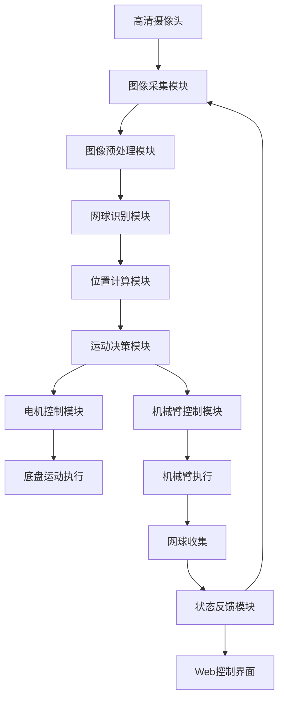

# 系统架构与原理

### 说明各模块功能：

1. **图像采集模块**：
   - 使用OpenCV捕获视频流
   - 支持多种图像编码格式（BGR8, RGB8, JPEG, PNG）
   - 文件：`color_detect.py`, `untils/untils.py`
2. **图像预处理模块**：
   - 高斯模糊降噪
   - 中值滤波
   - HSV颜色空间转换
   - 形态学操作（开闭运算）
   - 文件：`mycv/color.py`
3. **网球识别模块**：
   - HSV颜色阈值分割
   - 轮廓检测与分析
   - 圆形度计算（过滤非网球物体）
   - 文件：`mycv/color.py`
4. **位置计算模块**：
   - 计算网球中心坐标
   - 计算网球在图像中的比例
   - 计算与图像中心的偏移量
   - 文件：`car_cv.py`, `common/calculate.py`
5. **运动决策模块**：
   - PID控制器实现平滑运动
   - 目标丢失处理策略
   - 速度平滑处理
   - 文件：`car_cv.py`
6. **电机控制模块**：
   - 支持PCA9685和Modbus两种驱动方式
   - 运动指令封装
   - 文件：`motor/Motor.py`, `move.py`
7. **底盘运动执行**：
   - 四轮底盘控制
   - 前进/后退/转向执行
   - 文件：`motor/main.py`
8. **机械臂控制模块**：
   - 串口通信控制
   - 抓取动作序列控制
   - 文件：`color_detect.py` (机械臂控制部分)
9. **机械臂执行**：
   - 网球抓取动作
   - 网球放置动作
   - 文件：`color_detect.py`
10. **网球收集**：
    - 完成网球收集任务
    - 重置系统状态
11. **状态反馈模块**：
    - 实时视频流传输
    - 运动数据显示
    - 系统状态反馈
    - 文件：`control.py`, `templates/index.html`
12. **Web控制界面**：
    - 摇杆控制
    - 视频显示
    - 状态监控
    - 控制开关
    - 文件：`templates/index.html`

### 数据流说明：

**视觉处理流**：
摄像头 → 图像采集 → 预处理 → 网球识别 → 位置计算 → 运动决策

**控制执行流**：
运动决策 → 电机控制 → 底盘运动
运动决策 → 机械臂控制 → 机械臂执行 → 网球收集

**反馈流**：
状态反馈 → Web控制界面（用户）
状态反馈 → 图像采集（系统循环）

## 学习建议

1. 初学者应先配置好基础环境，运行简单的OpenCV示例验证摄像头工作正常
2. 使用`color_test.py`单独测试网球识别效果，调整HSV阈值参数
3. 通过`motor/test.py`测试电机基本功能
4. 最后尝试运行完整系统