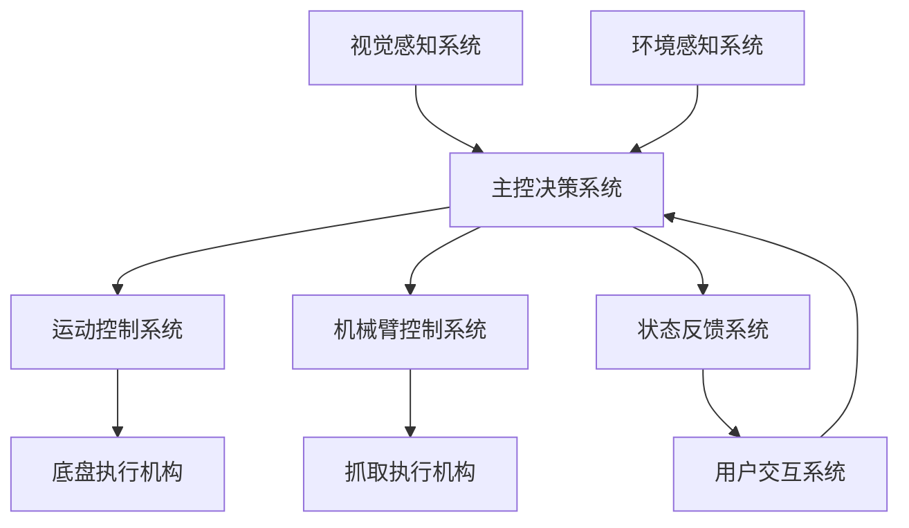
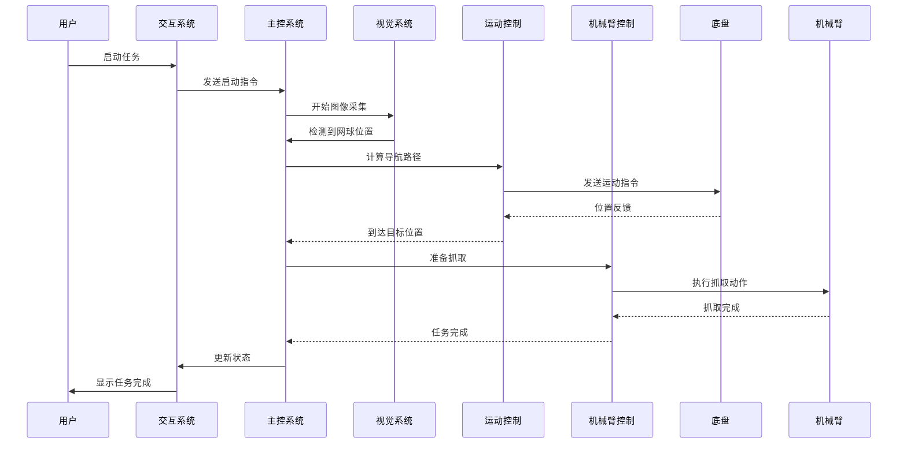

# 1.5 机器人系统架构

### 系统整体架构图

```mermaid
graph TD
    A[视觉感知系统] --> B[主控决策系统]
    B --> C[运动控制系统]
    B --> D[机械臂控制系统]
    C --> E[底盘执行机构]
    D --> F[抓取执行机构]
    G[用户交互系统] --> B
    H[环境感知系统] --> B
    B --> I[状态反馈系统]
    I --> G

```

### 系统模块划分与章节对应

**1.  视觉感知系统（第二章）**

- **功能**：采集环境图像，识别网球位置

**2.  主控决策系统（第六章）**

- **功能**：协调各子系统，制定行为策略

**3.  运动控制系统（第四章）**

- **功能**：控制机器人底盘运动

**4.  机械臂控制系统（第五章）**

- **功能**：控制机械臂完成抓取动作

**5.  底盘执行机构（第四章）**

- **功能**：驱动机器人移动

**6.  抓取执行机构（第五章）**

- **功能**：执行网球抓取动作

 **7.  用户交互系统（第七章）**

- **功能**：提供人机交互界面

 **8.  环境感知系统（第三章）**

- **功能**：感知周围环境状态

**9.  状态反馈系统（第七章）**

- **功能**：监控系统状态并提供反馈

### 系统工作流程

```mermaid
sequenceDiagram
    participant 用户
    participant 交互系统
    participant 主控系统
    participant 视觉系统
    participant 运动控制
    participant 机械臂控制
    participant 底盘
    participant 机械臂
    
    用户->>交互系统: 启动任务
    交互系统->>主控系统: 发送启动指令
    主控系统->>视觉系统: 开始图像采集
    视觉系统->>主控系统: 检测到网球位置
    主控系统->>运动控制: 计算导航路径
    运动控制->>底盘: 发送运动指令
    底盘-->>运动控制: 位置反馈
    运动控制-->>主控系统: 到达目标位置
    主控系统->>机械臂控制: 准备抓取
    机械臂控制->>机械臂: 执行抓取动作
    机械臂-->>机械臂控制: 抓取完成
    机械臂控制-->>主控系统: 任务完成
    主控系统->>交互系统: 更新状态
    交互系统->>用户: 显示任务完成

```

## 学习路径建议

1. **基础理论**（第二章）
   - 先理解数字图像处理基础
   - 掌握HSV颜色空间原理
   - 学习目标识别算法
2. **核心功能**（第三、四、五章）
   - 网球检测系统实现
   - 机器人运动控制原理
   - 机械臂控制技术
3. **系统框架**（第六章）
   - Dora-RS中间件架构
   - 数据流管理
   - 节点通信机制
4. **集成应用**（第七章）
   - 多模块协同工作
   - 系统服务化部署
   - 性能优化技巧
5. **实践创新**
   - 尝试改进网球识别算法
   - 优化运动控制参数
   - 扩展机械臂功能