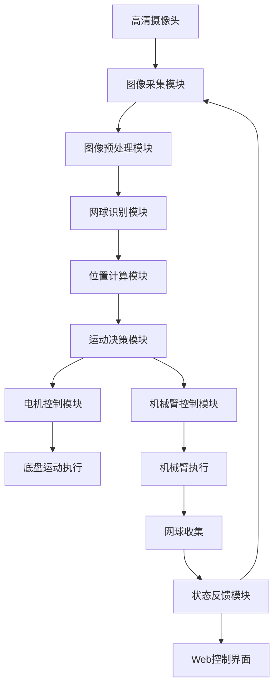

# 第一章 项目概述与环境搭建
## 1.1 项目目标与应用场景

### 项目目标

本项目旨在开发一个能够自动识别并收集网球的智能小车系统。系统通过摄像头实时捕捉环境图像，利用计算机视觉技术识别网球位置，然后控制小车移动并配合机械臂完成网球收集任务。项目融合了图像处理、运动控制和嵌入式系统开发等多个技术领域。

### 应用场景

1. **网球训练场**：自动收集散落在球场各处的网球
2. **体育器材管理**：减少人工收集成本
3. **教育演示**：机器人视觉系统的教学案例
4. **智能家居**：物品自动收集的参考实现

## 1.2 硬件组成清单

### 核心硬件

实际项目可能因具体版本有所调整，根据需求选择

| 部件         | 规格               | 功能说明             |
| ------------ | ------------------ | -------------------- |
| 主控板       | 飞腾派开发板       | 国产高性能嵌入式平台 |
| STM32控制器  | STM32F4系列开发板  | 实时运动控制         |
| 摄像头       | OV5647模块         | 500万像素，支持720P  |
| 电机驱动     | L298N双H桥驱动模块 | 直流电机控制         |
| 直流减速电机 | 12V/300RPM带编码器 | 四轮驱动             |
| 机械臂       | 4自由度串口舵机臂  | 支持角度控制         |

### 连接说明

1. 飞腾派通过USB串口连接STM32
2. STM32通过GPIO控制L298N
3. 摄像头直接连接到飞腾派CSI接口


## 1.3 软件环境配置指南

### 基础环境

```bash
sudo apt update
sudo apt install python3.11 python3.11-venv
```

### 创建虚拟环境

 为什么需要虚拟环境？：依赖隔离，版本控制，权限管理等

`pyproject.toml`中指定`requires-python = ">=3.8"`

```bash
python3.11 -m venv venv
source venv/bin/activate
```

### 安装核心依赖

```bash
pip install opencv-python==4.8.0.76
pip install numpy==1.24.3
pip install dora-rs==0.3.10
pip install pyarrow==12.0.1
pip install flask==2.3.2
pip install python-socketio==5.8.0
```

### 硬件驱动安装

```bash
# 安装I2C工具
sudo apt install i2c-tools

# 检测连接的I2C设备
sudo i2cdetect -y 1

# 安装串口工具
sudo apt install minicom
```

## 1.4 项目目录结构解析

### 项目目录结构

```
Phytium-Car-STM32-Arm-onPi/
│
├── car.service              # 系统服务配置文件（用于设置小车作为系统服务启动）
├── car.sh                   # 启动脚本（用于启动小车程序）
├── car_cv.py                # 小车视觉控制主逻辑（处理视觉数据并生成控制指令）
├── car_cv.yaml              # Dora框架配置文件（定义节点和输入输出关系）
├── car_stop.py              # 停止小车脚本（用于停止电机）
├── color_detect.py          # 颜色检测启动文件（主入口）
├── control.py               # 控制模块（提供Web控制界面和Socket.IO通信）
├── index.html               # Web控制界面HTML文件
├── move.py                  # 运动控制模块（封装运动指令发送）
├── README.md                # 项目说明文件
│
├── common/                  # 公共模块（数据结构和工具类）
│   ├── calculate.py         # 计算类（处理目标检测结果的数据结构）
│   ├── move_data.py         # 运动数据结构（用于节点间通信）
│   ├── test_move_data.py    # 运动数据结构测试
│   ├── view.py              # 视图数据类（用于Web显示）
│   └── __init__.py          # 包初始化文件
│
├── frame/                   # 存储摄像头捕获的原始帧图像
│
├── mask/                    # 存储掩膜图像
│
├── motor/                   # 电机控制模块
│   ├── main.py              # 电机控制主程序（接收运动指令并控制电机）
│   ├── Motor.py             # 电机控制基类和实现（PCA9685和Modbus）
│   ├── pyproject.toml       # 电机控制模块项目配置
│   └── test.py              # 电机控制测试脚本
│
├── mycv/                    # 计算机视觉模块
│   ├── color.py             # 颜色检测器类（识别网球）
│   ├── README.md            # 模块说明
│   └── __init__.py          # 包初始化文件
│
├── process/                 # 存储处理后的图像
│
├── templates/               # Web模板目录
│   └── index.html           # Web控制界面HTML模板
│
└── untils/                  # 工具模块
    ├── untils.py            # 工具函数（图像处理、方向转换等）
    └── __init__.py          # 包初始化文件
```


### **系统架构与原理**




### 说明各模块功能：

1. **图像采集模块**：
   - 使用OpenCV捕获视频流
   - 支持多种图像编码格式（BGR8, RGB8, JPEG, PNG）
   - 文件：`color_detect.py`, `untils/untils.py`
2. **图像预处理模块**：
   - 高斯模糊降噪
   - 中值滤波
   - HSV颜色空间转换
   - 形态学操作（开闭运算）
   - 文件：`mycv/color.py`
3. **网球识别模块**：
   - HSV颜色阈值分割
   - 轮廓检测与分析
   - 圆形度计算（过滤非网球物体）
   - 文件：`mycv/color.py`
4. **位置计算模块**：
   - 计算网球中心坐标
   - 计算网球在图像中的比例
   - 计算与图像中心的偏移量
   - 文件：`car_cv.py`, `common/calculate.py`
5. **运动决策模块**：
   - PID控制器实现平滑运动
   - 目标丢失处理策略
   - 速度平滑处理
   - 文件：`car_cv.py`
6. **电机控制模块**：
   - 支持PCA9685和Modbus两种驱动方式
   - 运动指令封装
   - 文件：`motor/Motor.py`, `move.py`
7. **底盘运动执行**：
   - 四轮底盘控制
   - 前进/后退/转向执行
   - 文件：`motor/main.py`
8. **机械臂控制模块**：
   - 串口通信控制
   - 抓取动作序列控制
   - 文件：`color_detect.py` (机械臂控制部分)
9. **机械臂执行**：
   - 网球抓取动作
   - 网球放置动作
   - 文件：`color_detect.py`
10. **网球收集**：
    - 完成网球收集任务
    - 重置系统状态
11. **状态反馈模块**：
    - 实时视频流传输
    - 运动数据显示
    - 系统状态反馈
    - 文件：`control.py`, `templates/index.html`
12. **Web控制界面**：
    - 摇杆控制
    - 视频显示
    - 状态监控
    - 控制开关
    - 文件：`templates/index.html`

### 数据流说明：

**视觉处理流**：
摄像头 → 图像采集 → 预处理 → 网球识别 → 位置计算 → 运动决策

**控制执行流**：
运动决策 → 电机控制 → 底盘运动
运动决策 → 机械臂控制 → 机械臂执行 → 网球收集

**反馈流**：
状态反馈 → Web控制界面（用户）
状态反馈 → 图像采集（系统循环）

## 学习建议

1. 初学者应先配置好基础环境，运行简单的OpenCV示例验证摄像头工作正常
2. 使用`color_test.py`单独测试网球识别效果，调整HSV阈值参数
3. 通过`motor/test.py`测试电机基本功能
4. 最后尝试运行完整系统