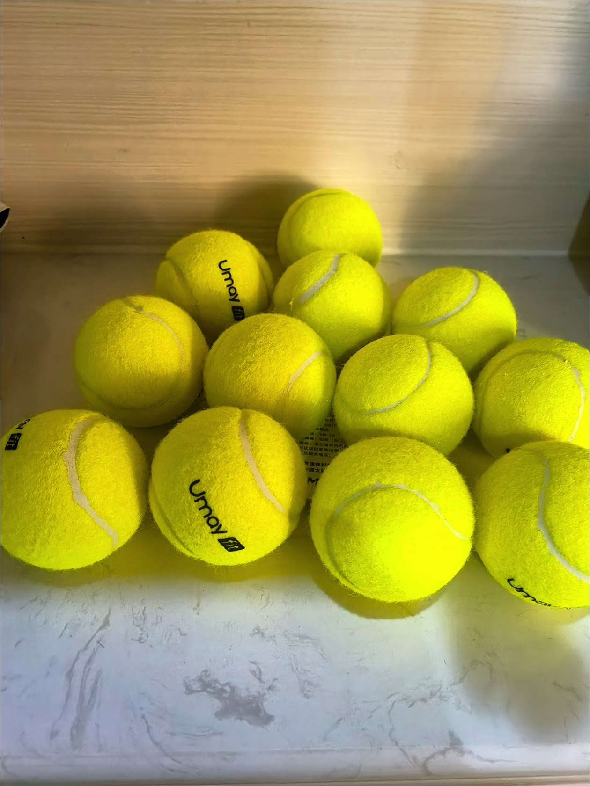
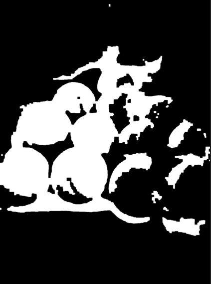
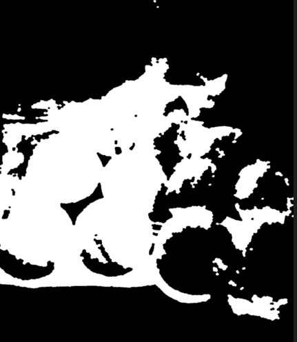
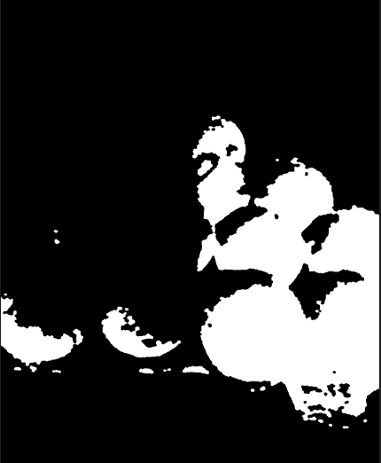

# 2.2 色彩空间与HSV原理

### RGB的局限性

RGB色彩空间对光照变化敏感，在网球识别中表现不佳。因此我们使用HSV色彩空间。

### HSV色彩空间

- **Hue(色调)**：颜色类型，0-180°（在OpenCV中）
- **Saturation(饱和度)**：颜色纯度，0-255
- **Value(明度)**：颜色亮度，0-255

HSV空间更接近人类对颜色的感知，对光照变化不敏感。

### 项目中的HSV处理

在`mycv/color.py`中实现：

```python
class ColorDetector:
    def __init__(self, lower_hsv, upper_hsv, min_area=300, max_area=10000):
        # 初始化HSV阈值范围
        self.lower = np.array(lower_hsv)
        self.upper = np.array(upper_hsv)
        self.min_area = min_area
        self.max_area = max_area
        # 创建形态学操作核
        self.kernel = cv2.getStructuringElement(cv2.MORPH_RECT, (5, 5))
    
    def process(self, frame):
        # 高斯模糊减少噪声
        blurred_img = cv2.GaussianBlur(frame, (5, 5), 0)
        
        # 中值滤波进一步减少噪声
        median_blur = cv2.medianBlur(blurred_img, 5)
        
        # 转换为HSV颜色空间
        hsv = cv2.cvtColor(median_blur, cv2.COLOR_BGR2HSV)
        
        # 创建颜色掩膜
        mask = cv2.inRange(hsv, self.lower, self.upper)
        
        # 形态学操作（消除噪声）
        mask = cv2.morphologyEx(mask, cv2.MORPH_OPEN, self.kernel, iterations=1)
        ma = mask  # 保存中间结果
        
        # 形态学操作（填充孔洞）
        mask = cv2.morphologyEx(mask, cv2.MORPH_CLOSE, self.kernel, iterations=3)
        mask = cv2.morphologyEx(mask, cv2.MORPH_OPEN, self.kernel, iterations=2)
        mask = cv2.GaussianBlur(mask, (5, 5), 0)
        
        # 查找轮廓
        contours, _ = cv2.findContours(mask, cv2.RETR_EXTERNAL, cv2.CHAIN_APPROX_SIMPLE)
        
        data = []
        processed_frame = frame.copy()
        
        # 处理每个检测到的轮廓
        for cnt in contours:
            area = cv2.contourArea(cnt)
            perimeter = cv2.arcLength(cnt, True)
            
            # 避免除零错误
            if perimeter == 0:
                continue
                
            circularity = 4 * np.pi * area / (perimeter * perimeter)
            
            # 过滤条件：面积和圆形度
            if area > self.min_area and area < self.max_area and circularity > 0.8:
                x, y, w, h = cv2.boundingRect(cnt)
                center_x = x + w // 2
                center_y = y + h // 2
                
                # 计算网球在图像中的比例
                ratio = (h / frame.shape[0]) * (w / frame.shape[1])
                
                # 在图像上标记网球
                cv2.rectangle(processed_frame, (x, y), (x + w, y + h), (0, 255, 0), 2)
                cv2.circle(processed_frame, (center_x, center_y), 5, (0, 0, 255), -1)
                cv2.putText(processed_frame, f"Ball:({center_x}, {center_y})", 
                           (center_x - 60, center_y - 20), cv2.FONT_HERSHEY_SIMPLEX, 
                           0.5, (255, 255, 255), 2)
                
                # 添加网球数据
                data.append([x, y, w, h])  # 项目中存储边界框而非Calculate对象
        
        return processed_frame, ma, data  # 返回原始掩膜和处理后图像
```


| 处理前                                              |  |
| --------------------------------------------------- | ------------------------ |
| HSV下限: [20, 100, 100]<br/>HSV上限: [30, 255, 255] |  |
| HSV下限: [20, 100, 70]<br/>HSV上限: [30, 255, 285]  |  |
| HSV下限: [30,70,80]<br />HSV上限: [50,255,255]      |  |


