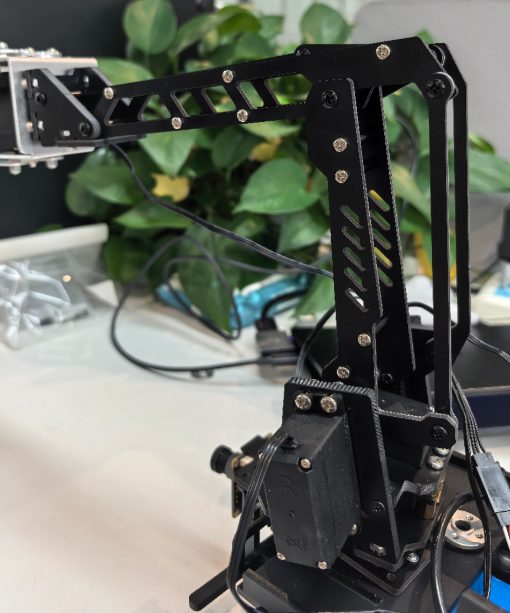

# 5.1 机械臂结构分析

### 4自由度机械臂设计

在项目中，机械臂采用4自由度设计，这种结构在灵活性和复杂度之间取得了良好平衡。机械臂的四个自由度分别为：

1. **基座旋转关节**（0-180°）：控制整个机械臂的水平旋转
2. **肩关节**（0-90°）：控制大臂的俯仰运动
3. **肘关节**（0-120°）：控制小臂的俯仰运动
4. **腕关节**（0-180°）：控制末端执行器的方向

**工作空间分析**：
 机械臂的工作空间是一个半球形区域，半径约30cm，高度范围15-45cm。这种设计特别适合地面网球捡拾任务，能够覆盖机器人周围的大部分区域。
 


舵机控制通过PCA9685模块实现：

```python
# motor/Motor.py
class PCA9685Motor(traitlets.HasTraits):
    def set_servo_angle(self, angle):
        """设置舵机角度"""
        min_pulse = 150
        max_pulse = 2500
        angle = max(0, min(180, angle))  # 限制角度在0-180度之间
        pulse_width = int((angle / 180.0) * (max_pulse - min_pulse) + min_pulse)
        duty_cycle = (pulse_width / 20000) * 4096  # 将脉冲宽度转换为占空比
        return int(duty_cycle)
    
    def set_servo(self, channel, angle1):
        """设置舵机角度到指定通道"""
        Duty_channel1 = self.set_servo_angle(angle1)
        # 设置PWM到指定通道
        self.set_channel_pwm(channel, 0, Duty_channel1)
    
    def set_channel_pwm(self, channel, on_value, off_value):
        """设置单个通道的PWM值"""
        self.bus.write_byte_data(
            self.PCA9685_ADDRESS, self.LED0_ON_L + 4 * channel, on_value & 0xFF
        )
        self.bus.write_byte_data(
            self.PCA9685_ADDRESS, self.LED0_ON_L + 4 * channel + 1, on_value >> 8
        )
        self.bus.write_byte_data(
            self.PCA9685_ADDRESS, self.LED0_ON_L + 4 * channel + 2, off_value & 0xFF
        )
        self.bus.write_byte_data(
            self.PCA9685_ADDRESS, self.LED0_ON_L + 4 * channel + 3, off_value >> 8
        )
```

### 机械臂预设位置

在项目中定义了多个预设位置：

```
# motor/Motor.py
class PCA9685Motor(traitlets.HasTraits):
    def __init__(self, d1, d2, d3, d4):
        # ...初始化代码...
        self.release_angle1 = 90  # 初始位置1
        self.release_angle2 = 87  # 初始位置2
    
    def traffic_light_release(self):
        """机械臂释放位置"""
        self.set_servo(12, self.release_angle1)
        self.set_servo(13, self.release_angle2)
    
    def servo_follow(self):
        """跟随位置"""
        self.set_servo(12, 100)
    
    def servo_poss(self):
        """拾取位置"""
        self.set_servo(12, 40)
    
    def servo_map(self):
        """地图位置"""
        self.set_servo(12, 105)
```

