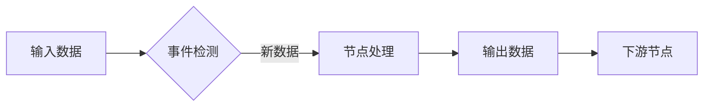

# 6.1 框架设计理念

### 数据流驱动架构

Dora-RS框架采用**数据流驱动**的设计理念，这是一种高度并行化的计算模型。在这种架构中，整个系统被分解为多个独立的节点(Node)，每个节点通过数据流(Dataflow)连接，形成有向无环图(DAG)。这种设计具有以下核心优势：

1. **天然的并行性**：节点间无共享状态，可并行执行
2. **松耦合**：节点只需关注输入输出，不依赖具体实现
3. **动态调度**：框架自动调度节点执行顺序
4. **可扩展性**：轻松添加新节点扩展功能

### 事件驱动模型

Dora采用**事件驱动**的执行模型，节点仅在接收到新数据时被激活：



这种模型显著降低了系统资源消耗，特别适合资源受限的嵌入式平台。节点可以定义多种事件触发器：

- 新数据到达
- 定时器触发
- 外部信号通知

### 零拷贝技术

Dora框架的核心创新之一是实现了**零拷贝数据传递**：

```c
// Rust底层实现
fn process_data(input: &[u8]) {
    // 直接操作输入数据缓冲区
    let result = transform(input);
    
    // 直接写入输出缓冲区
    output.write(result);
}
```

通过共享内存和智能指针管理，Dora避免了数据在节点间传递时的复制开销，这对于图像、点云等大数据量处理至关重要。