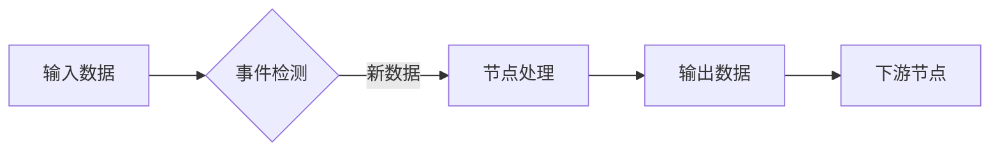

# 6.1 框架设计理念

### 数据流驱动架构实现

Dora-RS框架采用**数据流驱动**的设计理念，这是一种高度并行化的计算模型。在这种架构中，整个系统被分解为多个独立的节点(Node)，每个节点通过数据流(Dataflow)连接，形成有向无环图(DAG)。这种设计具有以下核心优势：

1. **天然的并行性**：节点间无共享状态，可并行执行
2. **松耦合**：节点只需关注输入输出，不依赖具体实现
3. **动态调度**：框架自动调度节点执行顺序
4. **可扩展性**：轻松添加新节点扩展功能

在项目中，Dora-RS框架通过数据流图定义系统架构：

```python
# car_cv.yaml中的节点配置
nodes:
  - id: opencv-video-capture
    path: opencv-video-capture
    inputs:
      tick: dora/timer/millis/50
    outputs:
      - image
  
  - id: color
    path: mycv/color.py
    inputs:
      image: opencv-video-capture/image
    outputs:
      - image
      - data
      - mask
  
  - id: car_cv
    path: car_cv.py
    inputs:
      data: color/data
      # state: arm/state
    outputs:
      - task
      - move
  
  - id: motor
    path: motor/main.py
    inputs:
      move: car_cv/move
```

### 事件驱动模型实现

Dora采用**事件驱动**的执行模型，节点仅在接收到新数据时被激活：


```mermaid
graph LR
    A[输入数据] --> B{事件检测}
    B -->|新数据| C[节点处理]
    C --> D[输出数据]
    D --> E[下游节点]
```

这种模型显著降低了系统资源消耗，特别适合资源受限的嵌入式平台。节点可以定义多种事件触发器：

- 新数据到达
- 定时器触发
- 外部信号通知

在项目中，节点通过事件处理函数响应输入：

```python
# motor/main.py中的事件处理
def main():
    node = Node()
    car_controller = ModbusMotor(port="/dev/ttyUSB0")
    
    for event in node:
        if event["type"] == "INPUT":
            event_id = event["id"]
            if event_id == "move":
                data = event["value"]
                move_data = MoveData.from_arrow_array(data)
                car_controller.Control(move_data)
        elif event["type"] == "STOP":
            move_data = MoveData(0, 0)
            car_controller.Control(move_data)
```

### 零拷贝技术实现

在项目中，通过共享内存实现**零拷贝数据传输**：

通过共享内存和智能指针管理，Dora避免了数据在节点间传递时的复制开销，这对于图像、点云等大数据量处理至关重要

```python
# common/calculate.py中的零拷贝处理
class Calculate:
    @staticmethod
    def to_pa_array(calc_list):
        data = [(c.x, c.y, c.ratio) for c in calc_list]
        return pa.array(
            data,
            type=pa.struct([
                pa.field("x", pa.int64()),
                pa.field("y", pa.int64()),
                pa.field("ratio", pa.float64()),
            ])
        )
    
    @staticmethod
    def from_pa_array(pa_array):
        return [
            Calculate(item["x"].as_py(), item["y"].as_py(), item["ratio"].as_py())
            for item in pa_array
        ]
```

