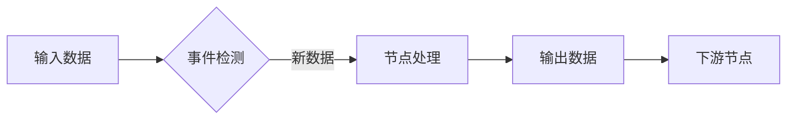

# 第六章 Dora-RS框架解析

## 6.1 框架设计理念

### 数据流驱动架构

Dora-RS框架采用**数据流驱动**的设计理念，这是一种高度并行化的计算模型。在这种架构中，整个系统被分解为多个独立的节点(Node)，每个节点通过数据流(Dataflow)连接，形成有向无环图(DAG)。这种设计具有以下核心优势：

1. **天然的并行性**：节点间无共享状态，可并行执行
2. **松耦合**：节点只需关注输入输出，不依赖具体实现
3. **动态调度**：框架自动调度节点执行顺序
4. **可扩展性**：轻松添加新节点扩展功能

### 事件驱动模型

Dora采用**事件驱动**的执行模型，节点仅在接收到新数据时被激活：



这种模型显著降低了系统资源消耗，特别适合资源受限的嵌入式平台。节点可以定义多种事件触发器：

- 新数据到达
- 定时器触发
- 外部信号通知

### 零拷贝技术

Dora框架的核心创新之一是实现了**零拷贝数据传递**：

```c
// Rust底层实现
fn process_data(input: &[u8]) {
    // 直接操作输入数据缓冲区
    let result = transform(input);
    
    // 直接写入输出缓冲区
    output.write(result);
}
```

通过共享内存和智能指针管理，Dora避免了数据在节点间传递时的复制开销，这对于图像、点云等大数据量处理至关重要。

## 6.2 核心组件剖析

### 节点生命周期管理

Dora节点具有明确定义的生命周期：

```python
class VideoCaptureNode:
    def __init__(self):
        """初始化资源"""
        self.cap = cv2.VideoCapture(0)
    
    def on_event(self, event):
        """事件处理"""
        if event['type'] == 'INPUT':
            self.process_frame()
    
    def process_frame(self):
        """处理帧数据"""
        ret, frame = self.cap.read()
        self.send_output('image', frame)
    
    def destroy(self):
        """资源释放"""
        self.cap.release()
```

### 消息路由机制

Dora的消息路由系统采用**发布-订阅模式**：

1. **主题注册**：节点声明输入/输出主题
2. **路由表构建**：框架构建全局路由表
3. **数据分发**：基于路由表高效分发数据
4. **负载均衡**：支持多节点并行处理同一主题

### 资源隔离技术

为确保系统稳定性，Dora实现了多级资源隔离：

1. **进程级隔离**：关键节点运行在独立进程
2. **内存隔离**：节点内存空间分离
3. **CPU隔离**：可绑定节点到特定CPU核心
4. **优先级控制**：实时任务优先级提升

## 6.3 通信机制实现

### 进程间通信(IPC)

Dora提供多种IPC机制适应不同场景：

| 通信方式     | 适用场景   | 性能 | 特点               |
| ------------ | ---------- | ---- | ------------------ |
| 共享内存     | 大数据传输 | 极高 | 零拷贝，需同步机制 |
| Unix域套接字 | 控制指令   | 高   | 低延迟，可靠       |
| TCP/IP       | 分布式节点 | 中   | 跨机器通信         |
| 消息队列     | 异步处理   | 中高 | 解耦生产消费       |

### 共享内存优化

Dora的共享内存实现包含多项优化：

```rust
// Rust底层实现
struct SharedBuffer {
    header: AtomicU64,      // 原子操作头信息
    data: [u8; BUFFER_SIZE] // 数据缓冲区
}

impl SharedBuffer {
    fn write(&mut self, data: &[u8]) {
        let len = data.len();
        self.header.store(len, Ordering::Release); // 原子写入长度
        self.data[..len].copy_from_slice(data);     // 数据复制
    }
    
    fn read(&self) -> &[u8] {
        let len = self.header.load(Ordering::Acquire); // 原子读取长度
        &self.data[..len] // 直接返回切片
    }
}
```

### 分布式部署方案

Dora支持分布式部署，关键特性包括：

1. **节点发现**：基于mDNS自动发现局域网节点
2. **数据路由**：跨机器数据自动路由
3. **负载均衡**：动态分配计算任务
4. **容错机制**：节点故障自动恢复

## 6.4 框架应用实践

### 节点开发规范

Dora节点开发遵循统一接口：

```python
class CustomNode:
    def __init__(self, config):
        """初始化配置"""
        self.config = config
    
    def on_event(self, event):
        """事件处理入口"""
        if event['type'] == 'INPUT':
            self.handle_input(event)
        elif event['type'] == 'TIMER':
            self.handle_timer(event)
    
    def handle_input(self, event):
        """处理输入数据"""
        data = event['data']
        # 处理逻辑...
        self.send_output('result', processed_data)
    
    def destroy(self):
        """资源清理"""
        pass
```

### 数据流拓扑构建

Dora使用YAML定义数据流拓扑：

```yaml
# car_cv.yaml
nodes:
  - id: video_capture
    path: nodes/video.py
    inputs:
      tick: dora/timer/millis/33  # 30FPS
    outputs:
      - image
      
  - id: ball_detector
    path: nodes/detector.py
    inputs:
      image: video_capture/image
    outputs:
      - position
      
  - id: controller
    path: nodes/controller.py
    inputs:
      position: ball_detector/position
    outputs:
      - motor_cmd
```

### 性能优化技巧

1. **批处理优化**：合并小数据包减少通信开销

   ```python
   def on_event(self, event):
       if event['type'] == 'TIMER':
           # 定时批量处理
           self.process_batch()
   ```

2. **数据压缩**：对图像等大数据启用压缩

   ```python
   self.send_output('image', frame, compress='jpeg', quality=80)
   ```

3. **零拷贝共享**：使用共享内存传递大数据

   ```python
   # 创建共享内存缓冲区
   shm = dora.create_shared_buffer('video_frame', 1024 * 1024)
   
   # 写入数据
   with shm.write_lock() as buffer:
       buffer[:len(frame)] = frame
   ```

4. **异步处理**：非关键任务异步执行

   ```python
   async def process_frame_async(frame):
       # 异步处理
       result = await heavy_computation(frame)
       return result
   ```

## 小结

Dora-RS框架是网球捡拾小车系统的核心基础设施。本章详细解析了其数据流驱动的架构设计、核心组件实现原理、高效通信机制以及实际应用技巧。通过Dora框架，我们实现了：

- 视觉采集、识别、控制模块的解耦
- 系统资源的高效利用
- 实时性能的保障
- 系统的可扩展性和可维护性