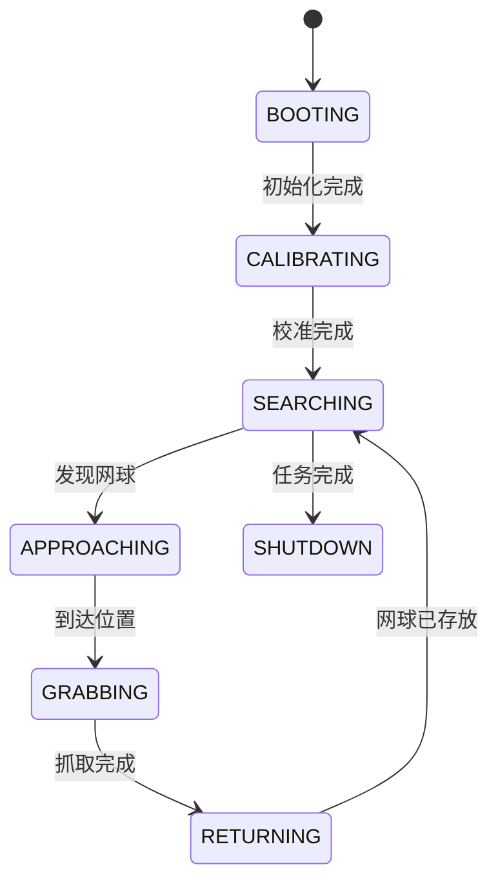

# 7.1 多模块协同架构

### 系统集成挑战与解决方案

网球捡拾小车是一个复杂的多模块系统，集成过程中面临三大核心挑战：

1. **时序同步问题**：

   - **现象**：视觉识别、底盘运动和机械臂动作不同步

   - 解决方案：

     ```python
     # 基于硬件时间戳的同步机制
     def process_frame():
         frame = camera.capture()
         frame.timestamp = time.monotonic_ns()  # 纳秒级时间戳
         return frame
     
     # 各模块使用相同时间基准
     current_time = time.monotonic_ns()
     ```

2. **数据一致性难题**：

   - **现象**：网球位置在传输过程中发生变化

   - 解决方案：

     ```python
     # 使用原子操作更新共享数据
     import threading
     ball_position = [0, 0]
     position_lock = threading.Lock()
     
     def update_position(new_pos):
         with position_lock:
             ball_position[:] = new_pos
     ```

3. **资源竞争冲突**：

   - **现象**：多个模块同时访问摄像头或串口

   - 解决方案：

     ```python
     # 资源管理器模式
     class ResourceManager:
         def __init__(self):
             self.lock = threading.RLock()
         
         @contextmanager
         def use_camera(self):
             with self.lock:
                 yield camera
     ```

### 系统状态管理

我们设计了一个全局状态机管理整个系统：



状态转换代码实现：

```python
class SystemStateMachine:
    def __init__(self):
        self.state = "BOOTING"
        self.transitions = {
            "BOOTING": self.handle_booting,
            "CALIBRATING": self.handle_calibrating,
            # ...其他状态处理
        }
    
    def handle_event(self, event):
        handler = self.transitions.get(self.state)
        if handler:
            new_state = handler(event)
            if new_state:
                self.state = new_state
                logger.info(f"状态转换: {self.state}")
    
    def handle_booting(self, event):
        if event == "INIT_DONE":
            return "CALIBRATING"
    
    def handle_calibrating(self, event):
        if event == "CALIBRATION_SUCCESS":
            return "SEARCHING"
        elif event == "CALIBRATION_FAILED":
            return "ERROR"
    # ...其他状态处理
```

