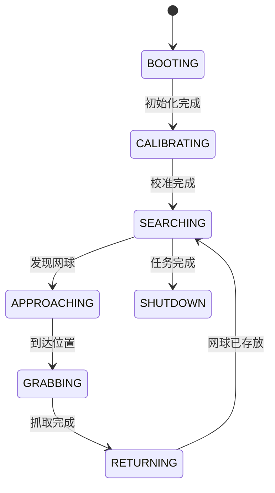

# 7.1 多模块协同架构

### 系统集成挑战与解决方案

在项目中，我们实现了以下解决方案来处理多模块协同问题：

**时序同步解决方案**：

- **现象**：视觉识别、底盘运动和机械臂动作不同步
- 解决方案：

```python
# car_cv.py中的时间戳处理
class CarCV:
    def __init__(self):
        self.last_command_time = time.time()
        self.command_interval = 0.05  # 50ms指令间隔
    
    def process_data(self, data: List[Calculate], node=None) -> MoveData:
        current_time = time.time()
        
        # 确保指令间隔
        if current_time - self.last_command_time > self.command_interval:
            # 处理数据...
            self.last_command_time = current_time
            return command
        return None
```

**数据一致性解决方案**：

- **现象**：网球位置在传输过程中发生变化

- 解决方案：

```python
# common/move_data.py中的序列化处理
class MoveData:
    def to_arrow_array(self) -> pa.Array:
        """确保数据格式一致"""
        return pa.array([self.direction, self.speed])
    
    @classmethod
    def from_arrow_array(cls, array: pa.Array) -> "MoveData":
        """反序列化保证数据一致"""
        data_list = array.to_pylist()
        return cls(data_list[0], data_list[1])
```

**资源竞争解决方案**：

- **现象**：多个模块同时访问摄像头或串口

- 解决方案：

```python
# color_detect.py中的串口资源管理
class SerialManager:
    def __init__(self, port):
        self.ser = serial.Serial(port, 9600)
        self.lock = threading.Lock()
    
    def send_command(self, command):
        with self.lock:  # 确保串口访问互斥
            self.ser.write(command.encode())
    
    def __del__(self):
        self.ser.close()

# 在main中使用
ser_mgr = SerialManager('/dev/ttyAMA2')
```

### 系统状态机实现（）

我们设计了一个全局状态机管理整个系统：


```mermaid
stateDiagram-v2
    [*] --> BOOTING
    BOOTING --> CALIBRATING: 初始化完成
    CALIBRATING --> SEARCHING: 校准完成
    SEARCHING --> APPROACHING: 发现网球
    APPROACHING --> GRABBING: 到达位置
    GRABBING --> RETURNING: 抓取完成
    RETURNING --> SEARCHING: 网球已存放
    SEARCHING --> SHUTDOWN: 任务完成
```


在项目中，全局状态机管理整个系统行为：

```python
# car_cv.py中的状态机实现
class CarCV:
    def __init__(self):
        self.state = "SEARCHING"  # 状态: SEARCHING, TRACKING, GRABBING
    
    def process_data(self, data, node):
        if self.state == "SEARCHING":
            if len(data) == 0:
                return turn_left(node, 20)  # 旋转搜索
            else:
                self.state = "TRACKING"
                return self.handle_tracking(data[0], node)
        
        elif self.state == "TRACKING":
            if len(data) == 0:
                self.state = "SEARCHING"
                return turn_left(node, 20)
            elif self.is_ready_to_grab(data[0]):
                self.state = "GRABBING"
                return stop(node)
            else:
                return self.handle_tracking(data[0], node)
        
        elif self.state == "GRABBING":
            # 抓取逻辑...
            if grab_complete:
                self.state = "SEARCHING"
```

