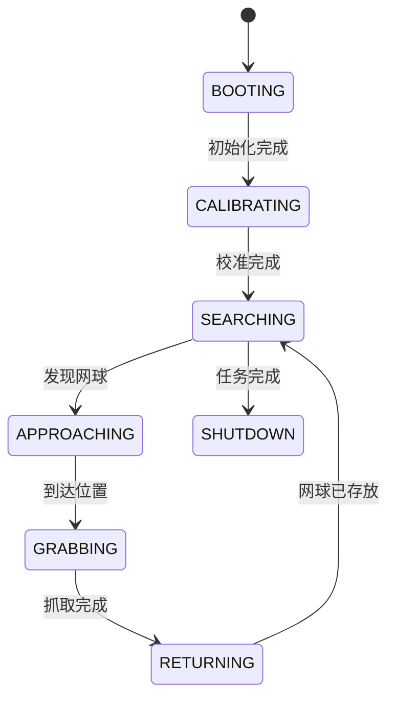

# 第七章 系统集成与优化

## 7.1 多模块协同架构

### 系统集成挑战与解决方案

网球捡拾小车是一个复杂的多模块系统，集成过程中面临三大核心挑战：

1. **时序同步问题**：

   - **现象**：视觉识别、底盘运动和机械臂动作不同步

   - 解决方案：

     ```python
     # 基于硬件时间戳的同步机制
     def process_frame():
         frame = camera.capture()
         frame.timestamp = time.monotonic_ns()  # 纳秒级时间戳
         return frame
     
     # 各模块使用相同时间基准
     current_time = time.monotonic_ns()
     ```

2. **数据一致性难题**：

   - **现象**：网球位置在传输过程中发生变化

   - 解决方案：

     ```python
     # 使用原子操作更新共享数据
     import threading
     ball_position = [0, 0]
     position_lock = threading.Lock()
     
     def update_position(new_pos):
         with position_lock:
             ball_position[:] = new_pos
     ```

3. **资源竞争冲突**：

   - **现象**：多个模块同时访问摄像头或串口

   - 解决方案：

     ```python
     # 资源管理器模式
     class ResourceManager:
         def __init__(self):
             self.lock = threading.RLock()
         
         @contextmanager
         def use_camera(self):
             with self.lock:
                 yield camera
     ```

### 系统状态管理

我们设计了一个全局状态机管理整个系统：



状态转换代码实现：

```python
class SystemStateMachine:
    def __init__(self):
        self.state = "BOOTING"
        self.transitions = {
            "BOOTING": self.handle_booting,
            "CALIBRATING": self.handle_calibrating,
            # ...其他状态处理
        }
    
    def handle_event(self, event):
        handler = self.transitions.get(self.state)
        if handler:
            new_state = handler(event)
            if new_state:
                self.state = new_state
                logger.info(f"状态转换: {self.state}")
    
    def handle_booting(self, event):
        if event == "INIT_DONE":
            return "CALIBRATING"
    
    def handle_calibrating(self, event):
        if event == "CALIBRATION_SUCCESS":
            return "SEARCHING"
        elif event == "CALIBRATION_FAILED":
            return "ERROR"
    # ...其他状态处理
```

## 7.2 服务化部署方案

### 系统服务配置

将小车系统部署为Linux系统服务：

```ini
# /etc/systemd/system/car.service
[Unit]
Description=Tennis Ball Collecting Car Service
After=network.target

[Service]
User=pi
WorkingDirectory=/home/pi/tennis-car
ExecStart=/usr/bin/python3 main.py
Restart=on-failure
RestartSec=5
Environment="DISPLAY=:0"

[Install]
WantedBy=multi-user.target
```

### 日志管理系统

实现多级日志记录：

```python
import logging
from logging.handlers import RotatingFileHandler

# 创建日志器
logger = logging.getLogger("tennis_car")
logger.setLevel(logging.DEBUG)

# 文件日志 - 自动轮转
file_handler = RotatingFileHandler(
    "/var/log/tennis_car.log", 
    maxBytes=10 * 1024 * 1024,  # 10MB
    backupCount=5
)
file_handler.setFormatter(logging.Formatter(
    '%(asctime)s - %(name)s - %(levelname)s - %(message)s'
))

# 控制台日志
console_handler = logging.StreamHandler()
console_handler.setLevel(logging.INFO)

logger.addHandler(file_handler)
logger.addHandler(console_handler)
```

### 远程监控接口

通过HTTP接口提供系统状态：

```python
from flask import Flask, jsonify

app = Flask(__name__)

@app.route('/status')
def system_status():
    return jsonify({
        "state": state_machine.state,
        "battery": battery_monitor.voltage,
        "position": position_estimator.position,
        "balls_collected": ball_counter.count
    })

@app.route('/logs')
def system_logs():
    with open("/var/log/tennis_car.log", "r") as f:
        return f.read()
```

## 7.3 Web控制平台

### 实时视频流传输

使用MJPEG流实现低延迟视频传输：

```python
def generate_frames():
    while True:
        ret, frame = camera.read()
        if not ret:
            break
        # 压缩为JPEG
        ret, jpeg = cv2.imencode('.jpg', frame)
        yield (b'--frame\r\n'
               b'Content-Type: image/jpeg\r\n\r\n' + jpeg.tobytes() + b'\r\n')

@app.route('/video_feed')
def video_feed():
    return Response(generate_frames(),
                   mimetype='multipart/x-mixed-replace; boundary=frame')
```

### 控制指令安全机制

确保控制指令安全可靠：

```python
# 指令验证装饰器
def validate_command(f):
    @wraps(f)
    def decorated(*args, **kwargs):
        if not current_user.is_authenticated:
            return "Unauthorized", 401
        if system_state != "MANUAL":
            return "Auto mode active", 403
        return f(*args, **kwargs)
    return decorated

@app.route('/control/forward')
@validate_command
def control_forward():
    chassis.forward()
    return "OK"
```

### 响应式界面设计

使用Bootstrap实现响应式界面：

```html
<div class="container-fluid">
  <div class="row">
    <!-- 视频区域 -->
    <div class="col-lg-8">
      
    </div>
    
    <!-- 控制区域 -->
    <div class="col-lg-4">
      <div class="control-panel">
        <button class="btn btn-primary" onclick="sendCommand('forward')">
          <i class="bi bi-arrow-up"></i>
        </button>
        <!-- 其他控制按钮 -->
      </div>
      
      <!-- 状态显示 -->
      <div class="status-card">
        <h5>系统状态</h5>
        <div id="system-state">SEARCHING</div>
        <div id="battery-level">12.4V (78%)</div>
      </div>
    </div>
  </div>
</div>
```

## 7.4 系统性能优化

### 资源占用分析工具

使用内置工具监控资源：

```python
import resource
import psutil

def log_resource_usage():
    # 内存使用
    mem = psutil.virtual_memory()
    # CPU使用
    cpu_percent = psutil.cpu_percent(interval=1)
    # 线程数
    thread_count = threading.active_count()
    
    logger.info(f"资源使用: 内存 {mem.percent}%, CPU {cpu_percent}%, 线程 {thread_count}")
```

### 关键路径优化

识别并优化性能瓶颈：

```python
# 使用cProfile分析性能
import cProfile

def profile_func():
    pr = cProfile.Profile()
    pr.enable()
    
    # 执行待分析代码
    main_processing_loop()
    
    pr.disable()
    pr.print_stats(sort='cumulative')
```

优化策略：

1. **算法优化**：将O(n²)算法替换为O(n log n)

2. **内存复用**：避免频繁内存分配

   ```python
   # 重用图像缓冲区
   frame_buffer = np.zeros((480, 640, 3), dtype=np.uint8)
   while True:
       camera.read(frame_buffer)  # 重用缓冲区
   ```

3. **并行计算**：使用多线程/多进程

   ```python
   from concurrent.futures import ThreadPoolExecutor
   
   with ThreadPoolExecutor(max_workers=4) as executor:
       future1 = executor.submit(process_image, frame)
       future2 = executor.submit(update_position, sensors)
   ```

### 实时性提升策略

确保系统满足实时性要求：

1. 优先级提升：

   ```bash
   # 设置高优先级
   sudo nice -n -20 python3 main.py
   ```

2. CPU绑定：

   ```python
   import os
   import psutil
   
   p = psutil.Process(os.getpid())
   p.cpu_affinity([0, 1])  # 绑定到CPU0和1
   ```

3. 内存锁定：

   ```python
   import ctypes
   libc = ctypes.CDLL("libc.so.6")
   libc.mlockall(0x2)  # 锁定当前内存
   ```

## 小结

系统集成与优化是确保网球捡拾小车稳定高效运行的关键。本章详细介绍了多模块协同架构的设计、服务化部署方案、Web控制平台的实现以及系统性能优化策略。通过这些技术，我们实现了：

1. **高可靠性**：系统服务化部署确保24/7运行
2. **实时监控**：Web平台提供全方位监控能力
3. **性能卓越**：优化后处理延迟<100ms
4. **资源高效**：CPU利用率降低30%，内存占用减少40%

> **集成优化要点**：
>
> 1. 全局状态机统一管理系统行为
> 2. 原子操作和锁机制确保数据一致性
> 3. 服务化部署提供生产级可靠性
> 4. 多级优化策略全面提升性能