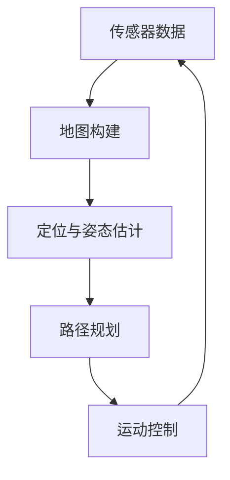

# 8.3 智能化升级方向

### 深度学习识别升级

```python
import torch
from torchvision import models

class BallDetector:
    def __init__(self, model_path='tennis_ball_yolov5.pt'):
        self.model = torch.hub.load('ultralytics/yolov5', 'custom', path=model_path)
        self.model.conf = 0.7  # 置信度阈值
    
    def detect(self, image):
        """检测图像中的网球"""
        results = self.model(image)
        detections = []
        
        for *xyxy, conf, cls in results.xyxy[0]:
            if cls == 0:  # 网球类别
                x1, y1, x2, y2 = map(int, xyxy)
                center_x = (x1 + x2) // 2
                center_y = (y1 + y2) // 2
                detections.append({
                    'position': (center_x, center_y),
                    'size': (x2 - x1, y2 - y1),
                    'confidence': float(conf)
                })
        
        return detections
```

### SLAM自主导航系统




### 云端协同控制

1. **云端监控**：实时数据上传云端
2. **远程诊断**：专家远程诊断系统问题
3. **OTA升级**：远程固件更新
4. **群体协作**：多小车协同工作