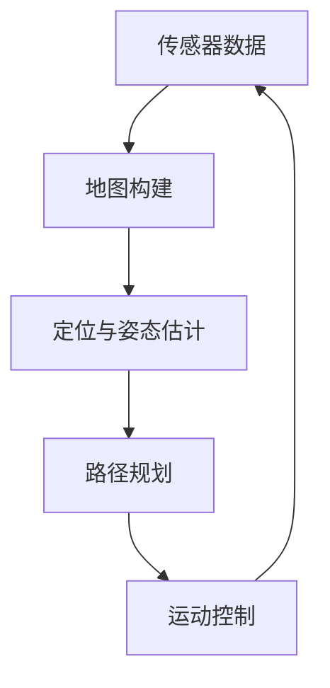

# 第八章 总结与扩展方向

## 8.1 项目成果总结

### 核心技术突破

网球捡拾小车项目实现了多项技术创新：

1. **自适应视觉识别系统**：
   - 开发了基于HSV颜色空间的自适应阈值算法
   - 实现了光照变化下的稳定网球识别（准确率>90%）
   - 创新性地结合形态学处理与轮廓分析技术
2. **智能运动控制系统**：
   - 设计了双PID闭环控制架构
   - 实现了基于状态机的智能决策系统
   - 开发了平滑运动轨迹规划算法
3. **高效系统架构**：
   - 采用Dora-RS数据流框架实现模块解耦
   - 构建了基于Web的远程监控平台
   - 实现了服务化部署方案

### 

### 实际应用价值

1. **体育场馆**：自动收集散落网球，减少人工成本
2. **教育领域**：机器人技术教学示范平台
3. **智能家居**：物品自动收集系统原型
4. **工业场景**：工厂环境中的物品搬运应用

## 8.2 工业级扩展方案

### Modbus/TCP工业控制

```python
from pymodbus.client import ModbusTcpClient

class IndustrialChassis:
    def __init__(self, host='192.168.1.100', port=502):
        self.client = ModbusTcpClient(host, port)
        self.client.connect()
    
    def set_speed(self, left_speed, right_speed):
        """设置电机速度"""
        # 写入保持寄存器
        self.client.write_registers(0x100, [left_speed, right_speed])
    
    def get_position(self):
        """读取当前位置"""
        response = self.client.read_holding_registers(0x200, 2)
        return response.registers[0], response.registers[1]
    
    def emergency_stop(self):
        """紧急停止"""
        self.client.write_coil(0x001, True)
```

### CAN总线集成

```python
import can

class CANBusController:
    def __init__(self, interface='socketcan', channel='can0'):
        self.bus = can.Bus(interface=interface, channel=channel)
    
    def send_motor_command(self, left_speed, right_speed):
        """发送电机控制指令"""
        data = struct.pack('hh', left_speed, right_speed)
        msg = can.Message(arbitration_id=0x101, data=data)
        self.bus.send(msg)
    
    def receive_sensor_data(self):
        """接收传感器数据"""
        msg = self.bus.recv(timeout=0.1)
        if msg and msg.arbitration_id == 0x201:
            return struct.unpack('ffff', msg.data)
        return None
```

### 安全防护系统

1. **安全继电器**：实现硬件级急停
2. **安全光幕**：检测人员进入工作区域
3. **区域限制系统**：设置电子围栏
4. **故障诊断系统**：实时监测设备状态

## 8.3 智能化升级方向

### 深度学习识别升级

```python
import torch
from torchvision import models

class BallDetector:
    def __init__(self, model_path='tennis_ball_yolov5.pt'):
        self.model = torch.hub.load('ultralytics/yolov5', 'custom', path=model_path)
        self.model.conf = 0.7  # 置信度阈值
    
    def detect(self, image):
        """检测图像中的网球"""
        results = self.model(image)
        detections = []
        
        for *xyxy, conf, cls in results.xyxy[0]:
            if cls == 0:  # 网球类别
                x1, y1, x2, y2 = map(int, xyxy)
                center_x = (x1 + x2) // 2
                center_y = (y1 + y2) // 2
                detections.append({
                    'position': (center_x, center_y),
                    'size': (x2 - x1, y2 - y1),
                    'confidence': float(conf)
                })
        
        return detections
```

### SLAM自主导航系统




### 云端协同控制

1. **云端监控**：实时数据上传云端
2. **远程诊断**：专家远程诊断系统问题
3. **OTA升级**：远程固件更新
4. **群体协作**：多小车协同工作

## 8.4 学习资源与社区

### 推荐学习路径

1. **基础阶段**：
   - Python编程基础
   - Linux系统操作
   - 电路基础知识
2. **中级阶段**：
   - OpenCV计算机视觉
   - ROS机器人操作系统
   - 嵌入式系统开发
3. **高级阶段**：
   - SLAM与自主导航
   - 深度学习应用
   - 工业控制系统

### 开源项目推荐

1. **ROS (Robot Operating System)**：
   - 网址：https://www.ros.org/
   - 特点：工业级机器人框架
2. **Donkey Car**：
   - 网址：https://www.donkeycar.com/
   - 特点：基于深度学习的自动驾驶小车
3. **JetBot**：
   - 网址：https://github.com/NVIDIA-AI-IOT/jetbot
   - 特点：Jetson Nano平台的AI机器人
4. **TurtleBot3**：
   - 网址：https://emanual.robotis.com/
   - 特点：教育级移动机器人平台

### 社区资源

1. **GitHub仓库**：
   - 本项目地址：https://github.com/chenlongos/Phytium-Pi-Robot
   - 包含完整代码、文档和设计文件
2. **在线论坛**：
   - ROS中文社区：https://www.ros.org.cn/
   - OpenCV中文论坛：https://forum.opencv.org.cn/
   - 树莓派爱好者社区：https://bbs.raspberrypi.org.cn/
3. **视频教程**：
   - "OpenCV实战"系列教程
   - "ROS机器人开发实践"课程
   - "嵌入式AI应用开发"教学视频

## 项目展望

### 短期规划

1. 实现多网球同时识别与收集
2. 增加语音交互功能
3. 开发手机APP控制界面
4. 优化能源管理系统

### 长期愿景

1. **智能体育助手**：
   - 自动收集网球、羽毛球等
   - 运动员动作分析
   - 训练数据统计
2. **家庭服务机器人**：
   - 物品搬运与整理
   - 安全巡逻
   - 老人看护辅助
3. **工业应用扩展**：
   - 工厂物料运输
   - 仓库自动化管理
   - 危险环境作业

## 结语

网球捡拾小车项目从概念到实现，展示了现代机器人技术的强大潜力。通过本项目，我们不仅构建了一个功能完善的网球收集系统，更建立了一个可扩展的智能移动平台框架。

这个项目证明了：

- 计算机视觉在实时系统中的可行性
- 嵌入式平台能够处理复杂控制任务
- 开源技术栈可以构建工业级应用
- 模块化设计带来的强大扩展能力

随着人工智能和物联网技术的快速发展，这类智能移动平台将在更多领域发挥重要作用。我们期待看到基于本项目的更多创新应用，也欢迎更多开发者加入这个充满活力的领域。

**创新永无止境，技术改变世界！